<h1 align="center">👾 Hey, it's Trae! 👽</h1>

  
  
  
  

  
<b>📊 Metrics</b>

  

  

  
  

|Tools|Technology|
|-----|----------|
|Stuff |   |
|Editor|![vsCode](https://img.shields.io/badge/vs%20code-0065a9?style=for-the-badge&logo=data:image/svg+xml;base64,PHN2ZyBmaWxsPSJub25lIiB2ZXJzaW9uPSIxLjEiIHZpZXdCb3g9IjAgMCAxMDAgMTAwIiB4bWxucz0iaHR0cDovL3d3dy53My5vcmcvMjAwMC9zdmciPgogPGcgY2xpcC1wYXRoPSJ1cmwoI2MpIj4KICA8bWFzayBpZD0iYiIgeD0iMCIgeT0iMCIgd2lkdGg9IjEwMCIgaGVpZ2h0PSIxMDAiIG1hc2stdHlwZT0iYWxwaGEiIG1hc2tVbml0cz0idXNlclNwYWNlT25Vc2UiPgogICA8cGF0aCBkPSJtNzAuOTEyIDk5LjU3MmMxLjU3NSAwLjYxNjcgMy4zNzA5IDAuNTc3NyA0Ljk2MDYtMC4xOTE2bDIwLjU4OC05Ljk1NzZjMi4xNjM2LTEuMDQ2IDMuNTM5Ni0zLjI0NjkgMy41Mzk2LTUuNjYxNXYtNjcuNTIyYzAtMi40MTQ1LTEuMzc2LTQuNjE1NC0zLjUzOTYtNS42NjE4bC0yMC41ODgtOS45NTgzYy0yLjA4NjMtMS4wMDkxLTQuNTI3OS0wLjc2MTk1LTYuMzU5IDAuNTc2Mi0wLjI2MTUgMC4xOTEwOS0wLjUxMDcgMC40MDQ1OC0wLjc0NDUgMC42Mzk3NWwtMzkuNDE0IDM2LjE0NC0xNy4xNjgtMTMuMWMtMS41OTgxLTEuMjE5My0zLjgzMzYtMS4xMTk0LTUuMzE3OCAwLjIzNzhsLTUuNTA2NCA1LjAzNDdjLTEuODE1NiAxLjY2MDItMS44MTc2IDQuNTMxMi0wLjAwNDQ4IDYuMTk0MWwxNC44ODkgMTMuNjU0LTE0Ljg4OSAxMy42NTRjLTEuODEzMSAxLjY2MjgtMS44MTExIDQuNTM0IDAuMDA0NDggNi4xOTQxbDUuNTA2NCA1LjAzNDdjMS40ODQzIDEuMzU3MSAzLjcxOTcgMS40NTc2IDUuMzE3OCAwLjIzNzdsMTcuMTY4LTEzLjA5OSAzOS40MTQgMzYuMTQ0YzAuNjIzNSAwLjYyNzIgMS4zNTU2IDEuMDk5NCAyLjE0MjkgMS40MDcyem00LjEwMzMtNzIuMzkxLTI5LjkwNiAyMi44MTkgMjkuOTA2IDIyLjgxOXYtNDUuNjM4eiIgY2xpcC1ydWxlPSJldmVub2RkIiBmaWxsPSIjZmZmIiBmaWxsLXJ1bGU9ImV2ZW5vZGQiLz4KICA8L21hc2s+CiAgPGcgbWFzaz0idXJsKCNiKSI+CiAgIDxwYXRoIGQ9Im05Ni40NjEgMTAuNTkzLTIwLjYwNS05Ljk3MjJjLTIuMzg1LTEuMTU0My01LjIzNTItMC42Njc0LTcuMTA2OSAxLjIxNDFsLTY3LjQ1MSA2MS44MTljLTEuODE0MyAxLjY2MjktMS44MTIyIDQuNTM0IDAuMDA0NDcgNi4xOTQxbDUuNTA5NyA1LjAzNDdjMS40ODUyIDEuMzU3MiAzLjcyMiAxLjQ1NjcgNS4zMjEgMC4yMzc4bDgxLjIyNy02MS45NGMyLjcyNS0yLjA3OCA2LjYzOTYtMC4xMjQzIDYuNjM5NiAzLjMxMzl2LTAuMjQwNGMwLTIuNDEzNS0xLjM3NjEtNC42MTM1LTMuNTM4Ni01LjY2MDV6IiBmaWxsPSIjRDlEOUQ5Ii8+CiAgIDxwYXRoIGQ9Im05Ni40NjEgODkuNDA3LTIwLjYwNSA5Ljk3MjNjLTIuMzg1IDEuMTU0My01LjIzNTIgMC42NjczLTcuMTA2OS0xLjIxNDZsLTY3LjQ1MS02MS44MTljLTEuODE0My0xLjY2MjctMS44MTIyLTQuNTMzOSAwLjAwNDQ3LTYuMTk0bDUuNTA5Ny01LjAzNDdjMS40ODUyLTEuMzU3MiAzLjcyMi0xLjQ1NzEgNS4zMjEtMC4yMzc3bDgxLjIyNyA2MS45NGMyLjcyNSAyLjA3ODQgNi42Mzk2IDAuMTI0NiA2LjYzOTYtMy4zMTR2MC4yNDA5YzAgMi40MTM0LTEuMzc2MSA0LjYxMzMtMy41Mzg2IDUuNjYwNHoiIGZpbGw9IiNlNmU2ZTYiLz4KICAgPHBhdGggZD0ibTc1Ljg1OCA5OS4zODFjLTIuMzg1NyAxLjE1NDMtNS4yMzU5IDAuNjY2My03LjEwNzgtMS4yMTU2IDIuMzA2NCAyLjMxNzkgNi4yNSAwLjY3NjQgNi4yNS0yLjYwMnYtOTEuMTI2YzAtMy4yNzg2LTMuOTQzNS00LjkyMDYtNi4yNS0yLjYwMjIgMS44NzE5LTEuODgxNyA0LjcyMjEtMi4zNjkyIDcuMTA3OC0xLjIxNmwyMC42IDkuOTU4M2MyLjE2NDYgMS4wNDY0IDMuNTQxNyAzLjI0NzMgMy41NDE3IDUuNjYxOHY2Ny41MjJjMCAyLjQxNDYtMS4zNzcxIDQuNjE0NS0zLjU0MTcgNS42NjE1eiIgZmlsbD0iI2ZmZiIvPgogICA8ZyBvcGFjaXR5PSIuMjUiIHN0eWxlPSJkaXNwbGF5Om5vbmU7bWl4LWJsZW5kLW1vZGU6b3ZlcmxheSI+CiAgICA8cGF0aCBkPSJtNzAuODUxIDk5LjU3MmMxLjU3NSAwLjYxNjcgMy4zNzEgMC41Nzc3IDQuOTYwNy0wLjE5MTZsMjAuNTg4LTkuOTU3NmMyLjE2MzUtMS4wNDYgMy41Mzg2LTMuMjQ2OSAzLjUzODYtNS42NjE1di02Ny41MjJjMC0yLjQxNDQtMS4zNzUxLTQuNjE1Mi0zLjUzODYtNS42NjE3bC0yMC41ODgtOS45NTg0Yy0yLjA4NjMtMS4wMDkxLTQuNTI4LTAuNzYxODQtNi4zNTkgMC41NzYyMS0wLjI2MTYgMC4xOTExOS0wLjUxMDcgMC40MDQ1OC0wLjc0NDYgMC42Mzk3NWwtMzkuNDE0IDM2LjE0NS0xNy4xNjgtMTMuMWMtMS41OTgxLTEuMjE5NC0zLjgzMzUtMS4xMTk1LTUuMzE3OCAwLjIzNzdsLTUuNTA2NCA1LjAzNDdjLTEuODE1NSAxLjY2MDItMS44MTc2IDQuNTMxMy0wLjAwNDQ4IDYuMTk0MWwxNC44ODggMTMuNjU0LTE0Ljg4OCAxMy42NTRjLTEuODEzMSAxLjY2MjgtMS44MTEgNC41MzM5IDAuMDA0NDggNi4xOTRsNS41MDY0IDUuMDM0OGMxLjQ4NDMgMS4zNTcxIDMuNzE5NyAxLjQ1NjYgNS4zMTc4IDAuMjM3N2wxNy4xNjgtMTMuMDk5IDM5LjQxNCAzNi4xNDRjMC42MjM2IDAuNjI3MiAxLjM1NTYgMS4wOTk0IDIuMTQyOSAxLjQwNzJ6bTQuMTAzNC03Mi4zOTEtMjkuOTA2IDIyLjgxOSAyOS45MDYgMjIuODE5eiIgY2xpcC1ydWxlPSJldmVub2RkIiBmaWxsPSJ1cmwoI2EpIiBmaWxsLXJ1bGU9ImV2ZW5vZGQiIG9wYWNpdHk9Ii4yNSIgc3R5bGU9ImRpc3BsYXk6bm9uZTttaXgtYmxlbmQtbW9kZTpvdmVybGF5Ii8+CiAgIDwvZz4KICA8L2c+CiA8L2c+CiA8ZGVmcz4KICA8bGluZWFyR3JhZGllbnQgaWQ9ImEiIHgxPSI0OS45MzkiIHgyPSI0OS45MzkiIHkxPSItNS4xOTc5ZS01IiB5Mj0iMTAwIiBncmFkaWVudFVuaXRzPSJ1c2VyU3BhY2VPblVzZSI+CiAgIDxzdG9wIHN0b3AtY29sb3I9IiNmZmYiIG9mZnNldD0iMCIvPgogICA8c3RvcCBzdG9wLWNvbG9yPSIjZmZmIiBzdG9wLW9wYWNpdHk9IjAiIG9mZnNldD0iMSIvPgogIDwvbGluZWFyR3JhZGllbnQ+CiAgPGNsaXBQYXRoIGlkPSJjIj4KICAgPHJlY3Qgd2lkdGg9IjEwMCIgaGVpZ2h0PSIxMDAiIGZpbGw9IiNmZmYiLz4KICA8L2NsaXBQYXRoPgogPC9kZWZzPgo8L3N2Zz4K)    |
|Frontend|  |
|Core|   |
|Backend|  
  

<!--
**traeblain/traeblain** is a ✨ _special_ ✨ repository because its `README.md` (this file) appears on your GitHub profile.

Here are some ideas to get you started:

- 🔭 I’m currently working on ...
- 🌱 I’m currently learning ...
- 👯 I’m looking to collaborate on ...
- 🤔 I’m looking for help with ...
- 💬 Ask me about ...
- 📫 How to reach me: ...
- 😄 Pronouns: ...
- ⚡ Fun fact: ...
-->
